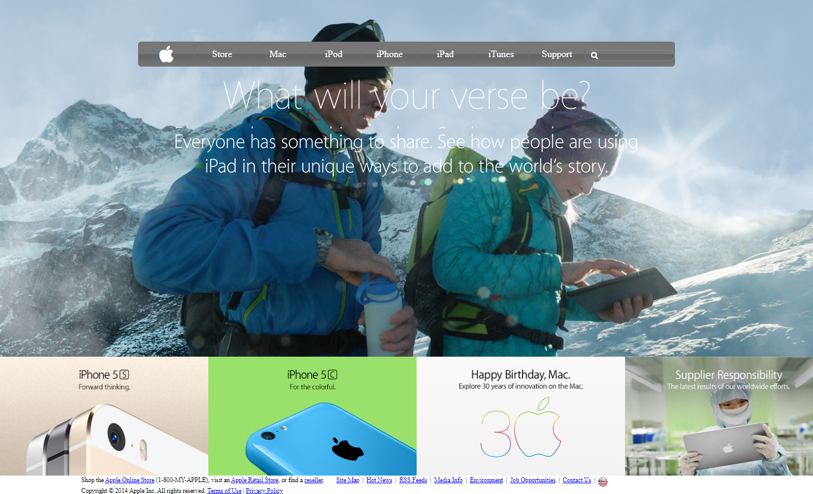

# apple-clon-page
This Project consists of making a clone of [Apple page](https://web.archive.org/web/20140301004610/http://www.apple.com/).
-Set up the main background image.
-Set up the top navigation bar. 
-using gradient background
-...

## Built With

- HTML,
- CSS

## Live Demo

[Go Live Demo](https://rawcdn.githack.com/beyk/apple-page/pull/2)
### Setup
> Just clone the project into you directory.

## Authors

👤 **Beyk**

- Github: [@beyk](https://github.com/beyk)
- Twitter: [@beyk_a](https://twitter.com/beyk_a)
## 🤝 Contributing

Contributions, issues and feature requests are welcome!

Feel free to check the [issues page](issues/).

## Show your support

Give a ⭐️ if you like this project!

## Acknowledgments

- Hat tip to anyone whose code was used

## 📝 License

This project is [MIT](lic.url) licensed.